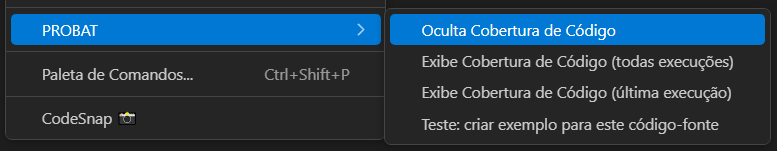

<!-- markdownlint-disable MD025 MD013-->
# Cobertura Código (todas as execuções)

A extensão permite solicitar um compilado com os resultados de Cobertura de Código considerando todas as execuções registradas no banco de dados do **PROBAT**.

Essa visão é especialmente útil para identificar se diferentes execuções — seja por pipelines ou suítes distintas — apresentaram variações na cobertura. Com base nesses dados, a equipe de DevOps pode avaliar e ajustar as esteiras de testes, buscando maior efetividade nos cenários automatizados.

## Como solicitar

Com um código-fonte aberto no VSCode, clique com o botão direito do mouse no editor e selecione a opção: "PROBAT > Exibe Cobertura de Código (todas execuções)", como mostrado na figura 01.

  
**Figura 01** – Solicitando a Cobertura de todas as execuções a partir de um código-fonte aberto

Isso abrirá uma visualização consolidada com os dados históricos de cobertura de código relacionados ao código-fonte em questão.

## Visualização

As informações detalhadas de como funciona a visualização encontram-se em [Visualizar Cobertura]({{ site.baseurl }}/docs/PROBAT_Code-Coverage-view/) desse manual.

## Removendo visualização

Para remover a decoração de cobertura de código aplicada ao arquivo-fonte, clique com o botão direito do mouse no editor do VSCode e selecione a opção:

"PROBAT > Oculta Cobertura de Código", conforme mostrado na figura 02.

  
**Figura 02** – Ocultando a cobertura de código do editor
