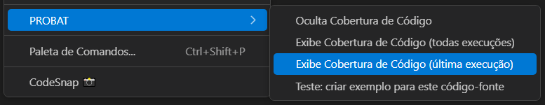
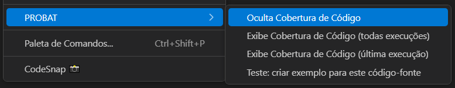

<!-- markdownlint-disable MD025 MD013-->
# Cobertura Código (última execução)

A extensão permite solicitar os dados de Cobertura de Código referentes apenas à última execução registrada no banco de dados do **PROBAT**.

Caso essa última execução possua um id_custom, os dados de cobertura serão consolidados entre todas as execuções que compartilham esse mesmo identificador. Isso permite uma visão unificada da cobertura gerada por múltiplos testes relacionados.

Essa funcionalidade é especialmente útil para:

* Validar a qualidade de testes executados por uma pipeline específica.

* Permitir que o desenvolvedor acompanhe a cobertura obtida a partir de uma execução filtrada, com foco nos arquivos em que está trabalhando.

## Como solicitar

Com um código-fonte aberto no VSCode, clique com o botão direito do mouse no editor e selecione a opção: "PROBAT > Exibe Cobertura de Código (última execução)", como mostrado na figura 01.

  
**Figura 01** – Solicitando a Cobertura da última execução a partir de um código-fonte aberto

Isso abrirá uma visualização consolidada com os dados históricos de cobertura de código relacionados ao código-fonte em questão.

## Visualização

As informações detalhadas de como funciona a visualização encontram-se em [Visualizar Cobertura]({{ site.baseurl }}/docs/PROBAT_Code-Coverage-view/) desse manual.

## Removendo visualização

Para remover a decoração de cobertura de código aplicada ao arquivo-fonte, clique com o botão direito do mouse no editor do VSCode e selecione a opção:

"PROBAT > Oculta Cobertura de Código", conforme mostrado na figura 02.

  
**Figura 02** – Ocultando a cobertura de código do editor
