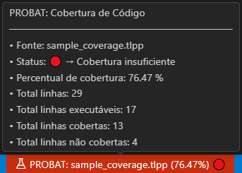

<!-- markdownlint-disable MD025 MD013-->
# Visualizando a Cobertura de Código

Neste documento, você encontrará diferentes formas de analisar as informações de cobertura de código.

Essas informações são apresentadas em:

- Percentual de cobertura;
- Status;
- Total de linhas do código-fonte;
- Total de linhas executáveis;
- Total de linhas cobertas (executadas);
- Total de linhas não cobertas.

## Decoração no código-fonte

Após solicitar o acesso às informações de Cobertura de Código, e desde que existam dados disponíveis para o código-fonte em questão, a extensão `tlpp-tools` irá decorar o código aberto no VSCode com indicadores visuais, como mostrado na *figura 01*.

Ao ativar a visualização de cobertura de código e havendo dados disponíveis para o arquivo aberto, a extensão `tlpp-tools` destaca o código no VSCode com marcadores visuais, como mostra a *figura 01*:

  
**Figura 01** – Código-fonte com marcações de cobertura.

Esses marcadores ajudam a identificar rapidamente quais trechos foram testados:

- **Linhas verdes**: foram executadas durante os testes;
- **Linhas vermelhas**: não foram executadas.

## Número de execuções por linha

Ao passar o mouse sobre uma linha do código, a extensão exibe uma dica com o número de vezes que aquela linha foi executada. Veja o exemplo na *figura 02*:

  
**Figura 02** – Código-fonte decorado com informações de cobertura.

## Barra de status

### Percentual de cobertura

A barra de status exibe o percentual atual de cobertura e uma indicação visual de seu status. Veja nas figuras a seguir:

  
**Figura 03** – Barra de Status de cobertura saudável

  
**Figura 04** – Barra de Status de cobertura que requer atenção

  
**Figura 05** – Barra de Status de cobertura insuficiente

### Tooltip (dica de cobertura)

Ao passar o mouse sobre a barra de status, é exibido um resumo com os principais dados da cobertura, como ilustrado nas figuras abaixo:

  
**Figura 06** – Barra de Status completa de cobertura saudável

  
**Figura 07** – Barra de Status completa de cobertura que requer atenção

  
**Figura 08** – Barra de Status completa de cobertura insuficiente

## Output Log

Essas mesmas informações também são registradas no painel de *Output* do `tlpp-tools`. Veja um exemplo na *figura 09*:

  
**Figura 09** – Output log de cobertura saudável

## Status da cobertura

O status da cobertura depende de uma configuração prévia no `PROBAT`, feita no arquivo `ini`, conforme o exemplo abaixo:

```ini
[PROBAT]
CODECOVERAGE=1
CODECOVERAGE_PERCENT=80
```

Nesse exemplo, foi definido um percentual mínimo de cobertura de 80%. Com base nisso, o status poderá ser:

Sendo assim, utilizando o percentual configurado poderemos ter as coberturas:

- **Saudável**  
  A cobertura está confortavelmente acima do mínimo definido.

- **No limite**  
  A cobertura está acima do mínimo, mas próxima do limite. *Requer atenção*.

- **Insuficiente**  
  A cobertura está abaixo do percentual estipulado.

- **Sem critério mínimo de cobertura definido**  
  Nenhum percentual foi configurado, então não é possível calcular o status.

### Sem status definido

Caso o percentual mínimo não tenha sido configurado, o status não será exibido — apenas os dados brutos, como percentual e linhas cobertas.

Nesse caso, a barra de status terá a aparência mostrada na figura 10:

  
**Figura 10** – Barra de Status completa de cobertura sem status
