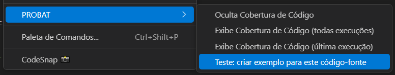

<!-- markdownlint-disable MD025 MD013-->
# Criação de Código-Testes

É possível utilizar a extensão como um facilitador na criação de código-fonte para testes, já com a sintaxe correta exigida pelo **PROBAT**.

**Atenção:** O código gerado contém apenas a estrutura básica do teste. A implementação da lógica de validação é de responsabilidade do desenvolvedor.

Além disso, o arquivo será automaticamente criado no diretório definido em seu `settings.json` do VSCode.

## Como utilizar

## Paleta de comandos

1. Pressione **Ctrl+Shift+P** para abrir a Paleta de Comandos do VSCode.

2. Digite **PROBAT: Teste:** para filtrar os comandos disponíveis.

3. Selecione a opção desejada, como "Crie um exemplo ..." (veja a Figura 01).

  
**Figura 01** – Paleta de comandos com as opções de *"Criação de exemplos de teste"*

## Menu de Contexto do Editor

Com um código-fonte aberto no VSCode, é possível gerar rapidamente um teste de exemplo utilizando o menu de contexto. Basta clicar com o botão direito do mouse e selecionar a opção "PROBAT > Teste: criar um exemplo para este código", como mostrado na figura 02.

  
**Figura 02** – Criando um teste a partir de um código-fonte aberto

Após selecionar a opção de criação, será exibida uma lista com os modelos disponíveis para escolha, conforme a figura 03.

  
**Figura 03** – Criando um teste a partir de um código-fonte aberto

> Para compreender as diferenças e aplicações de cada modelo, consulte a documentação oficial do **PROBAT**.
{: .callout .callout-info }
