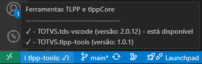
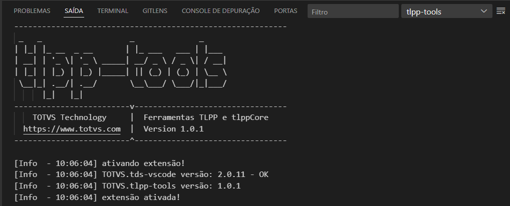
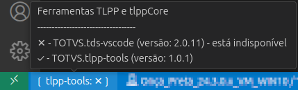

<!-- markdownlint-disable MD025 MD013-->
# Ativação da Extensão

Após a instalação, a ativação da extensão ocorre automaticamente ao abrir o VSCode.

No entanto, é importante observar que, caso o `tds-vscode` não esteja instalado ou não esteja na versão exigida, a extensão `tlpp-tools` será ativada apenas parcialmente. Nesse caso, os recursos que dependem da conexão com sua aplicação AppServer não estarão disponíveis.

Mas como saber se a extensão está ativada por completo?

## Barra de Status

A barra de status, localizada no canto inferior esquerdo do VSCode, exibe o status da ativação. Veja a Figura 01:

  
**Figura 01** – Ativação bem-sucedida indicada na barra de status

Ao posicionar o mouse sobre o ícone da extensão na barra de status, mais detalhes sobre o status da ativação são exibidos, conforme mostrado na Figura 02:

  
**Figura 02** – Informações adicionais ao passar o mouse sobre a barra de status

## Output Log

A barra de status do `tlpp-tools` possui uma funcionalidade adicional: ao clicar nela, o painel de **Output Log** da extensão é aberto, onde também é possível verificar o status da ativação. Veja a Figura 03:

  
**Figura 03** – Ativação bem-sucedida exibida no painel de output log

## Ativação Parcial

Se a extensão for ativada parcialmente, a barra de status exibirá uma indicação visual diferente, como mostrado na Figura 04:

  
**Figura 04** – Indicação de ativação parcial na barra de status

Além disso, o painel de output apresentará uma mensagem de advertência informando que certos recursos estão indisponíveis:

```log
[Warn  - 11:04:58] Funcionalidades que necessitam da versão correta do TDS foram desativadas! Recomendamos a instalação ou atualização para a versão mais recente.
```
