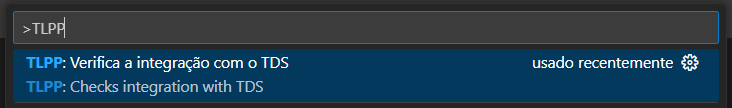
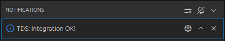
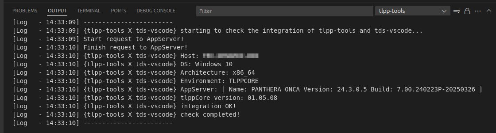
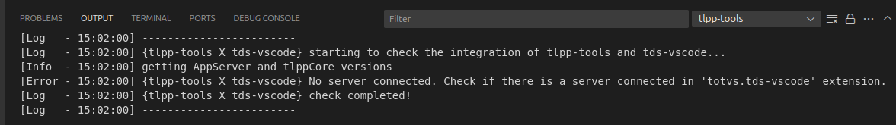

<!-- markdownlint-disable MD025 MD013-->
# Testando a conexão com AppServer

O `tlpp-tools` possui uma rotina nativa que permite testar a conexão com o *AppServer* e o *tlppCore* utilizando o `tds-vscode`.

Para utilizá-la, pressione **Ctrl+Shift+P** para abrir a paleta de comandos e digite **TLPP**. Isso filtrará e exibirá o comando **"Verifica a integração com o TDS"**, conforme mostrado na figura 01:

  
**Figura 01** – Paleta de comandos com a opção *"Verifica a integração com o TDS"*

Ao selecionar essa rotina, o `tlpp-tools` executará automaticamente o teste de conexão, exibindo o resultado de duas maneiras:

## Resultado

### Notificações

Uma mensagem será exibida no canto inferior direito do VSCode, conforme a figura 02:

  
**figura 02** – Notificação com mensagem de sucesso do teste

### tlpp-tools Log

Também é possível acompanhar o resultado no Output Log do `tlpp-tools`, como ilustrado nas figuras 03 e 04:

  
**figura 03** – Output Log - sucesso do teste!

  
**figura 04** – Output Log - erro do teste!

Se o teste não for bem-sucedido, acesse a seção **Solução de Problemas** para verificar as possíveis causas e orientações de correção.
